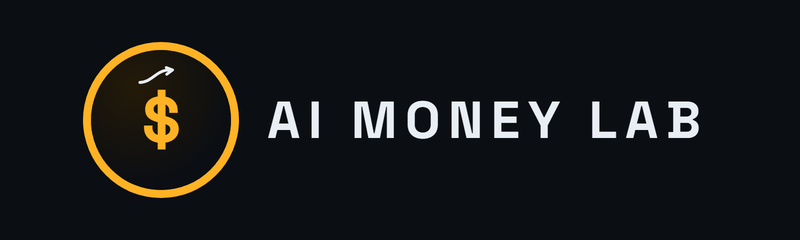

# 🚀 Awesome AI Money Tools

[English](README.md) | [中文](README-zh.md)

A curated list of high-leverage AI tools and proven monetization strategies to build a $0 to $10k/month automated income system. Updated daily by **AI Money Lab**.

> **"AI won't replace you, but a person using AI will."** — We help you be that person.

---

## 📈 Build In Public — Real Numbers (Aug 12–21)

Views per post since restarting on X:

→ Test post: 3
→ Day 1: 18
→ Day 2: 8
→ Day 3: 6
→ Day 4: 7
→ Day 5 Thread: 11
→ Day 6: 49
→ Day 7: 9

→ Day 8 (Grok kickoff): 31 (+1 ♥)

→ Day 9 (Grok test 01): 35

→ Day 10 (Grok test 02, video): 35

Total: 212 views across 11 posts (Test + Day 1–10). Followers gained: 0 (7 pre-existing). Money made: $0.
That is the real starting point — consistency is the test, not virality.
Week 2: fewer broadcasts, more engagement. Day 10 video test posted; Day 11 (Grok test 03, automation) in progress.

---

## 🎁 Free Preview + Full Toolkit

The free preview is the curated directory and practical roadmap on this page.

The paid bundle contains the complete, downloadable working files:

- **AI Money Blueprint 2026** — 15 step-by-step income methods
- **120 Money-Making AI Prompts** — ready-to-use delivery workflows
- **AI Tools Comparison 2026** — 61 tools across 16 categories

→ [Get the complete toolkit on Gumroad](https://aranajordy.gumroad.com/l/ai-money-blueprint-2026)

The complete files are no longer duplicated in this public repository.

---

## 🎬 English Short-Drama Localization

I also rewrite Chinese short-drama concepts and scripts for English-speaking audiences. This is not literal translation: hooks, dialogue, episode pacing, cliffhangers, and paywall cuts are rebuilt for the target market.

- One-episode paid pilot available
- 60–90 second vertical episodes
- Beat sheet, English script, shot cues, and two revision rounds
- Sample: *Global Freeze: My Warehouse Keeps Upgrading*

Starting at **$49 for a one-episode pilot**. Portfolio and sample episodes are available by DM on [X](https://twitter.com/CHiang_AILab).

---

## 🗺️ The Roadmap: From $0 to $10k
1.  **Phase 1: Skill Up** - Master 2-3 AI tools in a specific niche (e.g., Video, Copywriting).
2.  **Phase 2: First $100** - Offer services on Fiverr/Upwork or start a faceless channel.
3.  **Phase 3: Automation** - Use tools like Zapier/Make to remove yourself from the workflow.
4.  **Phase 4: Scaling** - Build an AI Agency or Launch a SaaS.

---

## 🛠️ Featured AI Tools Directory

### 📣 Content Creation & Social Media
| Tool | Best For | Monetization Angle |
|------|----------|-------------------|
| [ChatGPT](https://chat.openai.com) | Logic & Coding | Freelance coding, consulting, custom GPTs |
| [Claude](https://claude.ai) | Nuanced Writing | Ghostwriting, deep research reports |
| [Jasper](https://jasper.ai) | Enterprise Copy | High-ticket ad agency services |
| [Copy.ai](https://copy.ai) | Social Growth | Twitter/LinkedIn content management |

### 🎨 Design, Images & Branding
| Tool | Best For | Monetization Angle |
|------|----------|-------------------|
| [Midjourney](https://midjourney.com) | Photorealistic Art | Selling stock photos, POD (Print on Demand) |
| [Sora & GPT-Image](https://sora.com) | AI Video & Images | Short-form video, custom visuals |
| [Canva AI](https://canva.com) | Fast Templates | Managing small business social media |
| [Leonardo AI](https://leonardo.ai) | Consistent Assets | Game asset design, NFT collections |

### 🎬 Video & Audio Production
| Tool | Best For | Monetization Angle |
|------|----------|-------------------|
| [ElevenLabs](https://elevenlabs.io) | Voice Cloning | Audiobook narration, Faceless YouTube |
| [HeyGen](https://heygen.com) | Avatar Videos | Corporate training, multilingual ads |
| [Descript](https://descript.com) | Video Editing | High-speed podcast/YouTube editing |
| [Runway](https://runwayml.com) | Generative Video | Cinematic stock footage, VFX services |

### 💰 All-in-One Business & Automation
| Tool | Best For | Monetization Angle |
|------|----------|-------------------|
| [Systeme.io](https://systeme.io/zh?sa=sa0267136844cd4d8b3300479b6a2d3e80954b5050) | **Core Business Hub** | Build funnels, sell courses, email marketing (60% Commission) |
| [Gumloop](https://gumloop.com/) | **Complex Workflows** | High-revenue AI Automation Agency (AAA) services |
| [Make.com](https://make.com) | Multi-tool Workflows | Building custom AI automation for businesses |
| [Zapier](https://zapier.com) | Simple Integration | Quick workflow fixes for small teams |

---

## 💸 Proven Money-Making Methods

### 🟢 Beginner (Entry Level)
- **AI-Powered Freelance Writing**: Use Claude to write SEO-optimized blogs for niche sites.
- **AI Art for Etsy**: Create unique digital art prints using Midjourney and sell as downloads.
- **Translation Services**: Use AI to translate and localize video scripts for creators.

### 🟡 Intermediate (Building Assets)
- **Faceless YouTube Empire**: Combine ElevenLabs (Voice) + HeyGen (Visuals) + ChatGPT (Script).
- **AI Newsletters**: Use AI to curate and summarize niche news. Monetize via Beehiiv/Substack.
- **Micro-SaaS**: Build a single-purpose AI tool (e.g., "AI Resume Tuner") and charge $5/mo.

### 🔴 Advanced (Scaling Systems)
- **AI Automation Agency (AAA)**: Charge businesses $2k-5k/mo to automate their repetitive tasks.
- **AI Consulting**: Audit companies and implement AI workflows for efficiency.
- **High-Ticket Courses**: Teach others how you achieved specific results with AI.

---

## 🛡️ Trust & Transparency

At **AI Money Lab**, we only list tools that we have tested or that have a proven track record of helping creators earn. 

**Affiliate Disclosure**: Some links in this repository are affiliate links. This means if you click on the link and purchase the item, I will receive an affiliate commission at no extra cost to you. This helps support the maintenance of this repository.

---

## 🤝 Contributing & Community

We welcome contributions! Have an AI tool that makes money?
1. Fork the repo.
2. Add your tool with a monetization angle.
3. Submit a Pull Request.

- **Twitter**: [@CHiang_AILab](https://twitter.com/CHiang_AILab) - Daily hacks and build-in-public updates.
- **Stars**: If this list helps you, please give us a ⭐!

---
*Last updated: August 20, 2026 | Built with ❤️ for the AI Creator Community.*
